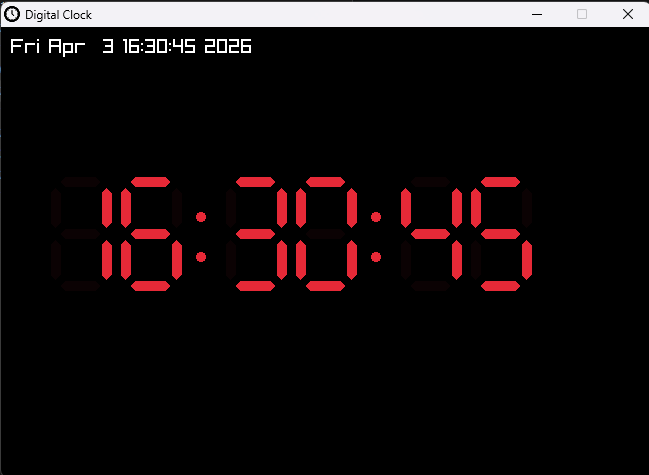

# Digital Clock

This is the first of my learning Projects to learn more about c/c++ and extend my skills in low level Programing.

This Project show a Digital Clock that ist Custom Rendered.  

---

Learned Skills:
- Learn Basic use of RayLib
- Render Custom Numbers in RayLib
- Learn more about program professional Apps on Windows with C/C++
- Learn more about get Time in C/C++ and convert it from Number to String

---

### Screenshot

---

### License